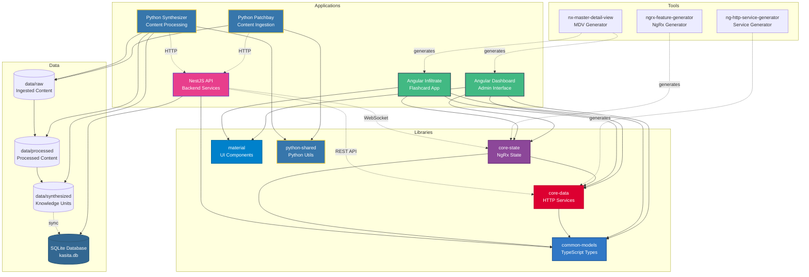

# Kasita Workspace Architecture

This document provides a visual overview of the Kasita workspace architecture and how components interact.

## Architecture Diagram



## Component Descriptions

### Applications

- **Dashboard** - Angular admin dashboard for managing learning paths, knowledge units, and content
- **Infiltrate** - Angular flashcard application for spaced repetition learning
- **API** - NestJS REST API with WebSocket support for real-time updates
- **Patchbay** - Python service for ingesting content from RSS feeds, articles, and PDFs
- **Synthesizer** - Python service for processing raw content into knowledge units using embeddings and LLMs

### Libraries

- **common-models** - Shared TypeScript interfaces and types (source of truth for data models)
- **core-data** - Angular HTTP services for API communication
- **core-state** - NgRx state management with feature modules for each entity
- **material** - Angular Material UI components and modules
- **python-shared** - Shared Python utilities for file I/O, logging, and common functions

### Tools

- **ng-http-service-generator** - Custom Nx generator for creating Angular HTTP services
- **ngrx-feature-generator** - Custom Nx generator for creating NgRx feature modules
- **nx-master-detail-view** - Custom Nx generator for creating master-detail view components

### Data Flow

1. **Ingestion**: Patchbay fetches content from sources → stores in `data/raw/`
2. **Processing**: Synthesizer reads raw content → generates embeddings → clusters content
3. **Synthesis**: Synthesizer generates knowledge units from clusters → stores in `data/synthesized/`
4. **Storage**: Knowledge units are synced to the SQLite database via API
5. **Consumption**: Angular apps fetch data through core-data services → update state via NgRx

## Technology Stack

- **Frontend**: Angular 21, NgRx, Angular Material, TypeScript
- **Backend**: NestJS, TypeORM, SQLite (Turso/libSQL)
- **Python**: uv, sentence-transformers, Anthropic Claude API
- **Monorepo**: Nx 22
- **Testing**: Jest, Vitest, Playwright

## Dependencies

### Angular Apps Dependencies
Both `dashboard` and `infiltrate` depend on:
- `@kasita/common-models` - Type definitions
- `@kasita/core-data` - HTTP services
- `@kasita/core-state` - State management
- `@kasita/material` - UI components

### Library Dependencies
- `core-data` depends on `common-models`
- `core-state` depends on `common-models` and `core-data`

### Python Services
- Both `patchbay` and `synthesizer` use `python-shared`
- Both communicate with the API via HTTP

---

*This diagram is auto-generated. To regenerate, run:*
```bash
./scripts/generate-architecture-diagram.sh
```
