# Kasita Workspace Architecture

This document provides a visual overview of the Kasita workspace architecture and how components interact.

## Architecture Diagram

```mermaid
graph TB
    subgraph "Applications"
        Dashboard[Angular Dashboard<br/>Admin Interface]
        Infiltrate[Angular Infiltrate<br/>Flashcard App]
        API[NestJS API<br/>Backend Services]
        Patchbay[Python Patchbay<br/>Content Ingestion]
        Synthesizer[Python Synthesizer<br/>Content Processing]
    end

    subgraph "Libraries"
        CommonModels[common-models<br/>TypeScript Types]
        CoreData[core-data<br/>HTTP Services]
        CoreState[core-state<br/>NgRx State]
        Material[material<br/>UI Components]
        PythonShared[python-shared<br/>Python Utils]
    end

    subgraph "Tools"
        HttpGen[ng-http-service-generator<br/>Service Generator]
        NgRxGen[ngrx-feature-generator<br/>NgRx Generator]
        MDVGen[nx-master-detail-view<br/>MDV Generator]
    end

    subgraph "Data"
        RawData[(data/raw<br/>Ingested Content)]
        ProcessedData[(data/processed<br/>Processed Content)]
        SynthesizedData[(data/synthesized<br/>Knowledge Units)]
        Database[(SQLite Database<br/>kasita.db)]
    end

    %% Angular Apps → Libraries
    Dashboard --> CoreData
    Dashboard --> CoreState
    Dashboard --> Material
    Dashboard --> CommonModels
    
    Infiltrate --> CoreData
    Infiltrate --> CoreState
    Infiltrate --> Material
    Infiltrate --> CommonModels

    %% Libraries → Libraries
    CoreData --> CommonModels
    CoreState --> CommonModels
    CoreState --> CoreData

    %% API Dependencies
    API --> CommonModels
    API --> Database
    
    subgraph "API Modules"
        AuthModule[Auth Module<br/>JWT Authentication]
        UsersModule[Users Module<br/>User Management]
        DataSourcesModule[Data Sources<br/>Content Sources]
        KnowledgeGraphModule[Knowledge Graph<br/>Relationships]
    end
    
    API --> AuthModule
    API --> UsersModule
    API --> DataSourcesModule
    API --> KnowledgeGraphModule

    %% Python Services
    Patchbay --> PythonShared
    Patchbay --> RawData
    Patchbay -.HTTP.-> API
    
    Synthesizer --> PythonShared
    Synthesizer --> RawData
    Synthesizer --> ProcessedData
    Synthesizer --> SynthesizedData
    Synthesizer -.HTTP.-> API

    %% Tools generate code
    HttpGen -.generates.-> CoreData
    NgRxGen -.generates.-> CoreState
    MDVGen -.generates.-> Dashboard
    MDVGen -.generates.-> Infiltrate

    %% Data Flow
    RawData --> ProcessedData
    ProcessedData --> SynthesizedData
    SynthesizedData -.sync.-> Database

    %% API → Frontend
    API -.REST API.-> CoreData
    API -.WebSocket.-> CoreState

    style Dashboard fill:#42b983,stroke:#35495e,stroke-width:2px,color:#fff
    style Infiltrate fill:#42b983,stroke:#35495e,stroke-width:2px,color:#fff
    style API fill:#e83e8c,stroke:#6f42c1,stroke-width:2px,color:#fff
    style Patchbay fill:#3776ab,stroke:#ffd43b,stroke-width:2px,color:#fff
    style Synthesizer fill:#3776ab,stroke:#ffd43b,stroke-width:2px,color:#fff
    style CommonModels fill:#3178c6,stroke:#235a97,stroke-width:2px,color:#fff
    style CoreData fill:#dd0031,stroke:#c3002f,stroke-width:2px,color:#fff
    style CoreState fill:#8c4799,stroke:#6a2c7a,stroke-width:2px,color:#fff
    style Material fill:#0081cb,stroke:#006ba3,stroke-width:2px,color:#fff
    style PythonShared fill:#3776ab,stroke:#ffd43b,stroke-width:2px,color:#fff
    style Database fill:#336791,stroke:#2d5a7a,stroke-width:2px,color:#fff
```



## Component Descriptions

### Applications

- **Dashboard** - Angular admin dashboard for managing learning paths, knowledge units, users, data sources, and interactive knowledge graph visualization (Three.js, Cytoscape.js, D3.js)
- **Infiltrate** - Angular flashcard application for spaced repetition learning
- **API** - NestJS REST API with WebSocket support for real-time updates, JWT authentication, and comprehensive CRUD operations
- **Patchbay** - Python service for ingesting content from RSS feeds, articles, and PDFs
- **Synthesizer** - Python service for processing raw content into knowledge units using embeddings and LLMs

### Libraries

- **common-models** - Shared TypeScript interfaces and types (source of truth for data models including User, DataSource, KnowledgeGraph entities)
- **core-data** - Angular HTTP services for API communication, authentication service, and dynamic form field definitions
- **core-state** - NgRx state management with feature modules for all entities (including users)
- **material** - Angular Material UI components and modules (confirmation dialogs, etc.)
- **python-shared** - Shared Python utilities for file I/O, logging, and common functions

### Tools

- **ng-http-service-generator** - Custom Nx generator for creating Angular HTTP services
- **ngrx-feature-generator** - Custom Nx generator for creating NgRx feature modules
- **nx-master-detail-view** - Custom Nx generator for creating master-detail view components

### API Modules

- **Auth Module** - JWT-based authentication, Passport.js strategies, login/register endpoints
- **Users Module** - User CRUD operations, role management (guest, user, manager, admin)
- **Data Sources Module** - Global content source management, scheduling, archive parsing
- **Knowledge Graph Module** - Relationship queries, graph generation, search functionality

### Data Flow

1. **Ingestion**: Patchbay fetches content from data sources → stores in `data/raw/` → POSTs to API
2. **Processing**: Synthesizer reads raw content from API → generates embeddings → clusters content → stores in `data/processed/`
3. **Synthesis**: Synthesizer generates knowledge units from clusters → stores in `data/synthesized/` → POSTs to API
4. **Storage**: All data synced to SQLite database via API (users, learning paths, knowledge units, data sources, etc.)
5. **Graph Building**: Knowledge graph module analyzes relationships and builds graph structure
6. **Consumption**: Angular apps fetch data through core-data services → update state via NgRx → display in UI/graph visualizations

## Technology Stack

- **Frontend**: Angular 21, NgRx, Angular Material, Tailwind CSS, Three.js, Cytoscape.js, D3.js, TypeScript
- **Backend**: NestJS, TypeORM, SQLite (via sqlite3/libSQL), Passport.js, JWT, Socket.io, Swagger/OpenAPI
- **Authentication**: JWT tokens, bcrypt password hashing, role-based access control
- **Python**: uv, sentence-transformers, Anthropic Claude API, Pydantic
- **Monorepo**: Nx 22
- **Testing**: Jest, Vitest, Playwright

## Dependencies

### Angular Apps Dependencies
Both `dashboard` and `infiltrate` depend on:
- `@kasita/common-models` - Type definitions
- `@kasita/core-data` - HTTP services
- `@kasita/core-state` - State management
- `@kasita/material` - UI components

### Library Dependencies
- `core-data` depends on `common-models`
- `core-state` depends on `common-models` and `core-data`

### Python Services
- Both `patchbay` and `synthesizer` use `python-shared`
- Both communicate with the API via HTTP

---

*This diagram is auto-generated. To regenerate, run:*
```bash
./scripts/generate-architecture-diagram.sh
```
